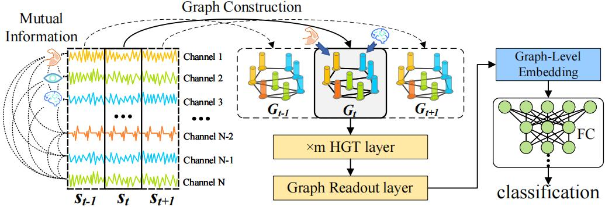

# Heterogeneous Graph Pooling Neural Network for Sleep Stage Classification



In this paper, we propose a novel deep model SleepHGNN for sleep stage classification. The Heterogeneous Graph Transformer is applied for capturing the interactivity and heterogeneity of the multimodal signals. To the best of our knowledge, this is the first attempt to leverage heterogeneous graph neural networks for sleep stage classification. The experiments on the benchmark dataset prove that SleepHGNN outperforms the state-of-the-art models on the sleep stage classification task. Since the SleepHGNN is a universal framework for the graph-level classification task based on the heterogeneous graph, we will generalize model to other domains like
protein classification and molecular graph classification including anticancer chemical compound classification in the future.

## Requirements

- Python 3.7
- PyTorch 1.8.0
- PyTorch Geometric 1.7.0
- MNE 1.3.1
- CUDA 10.1

#### Steps:

1. Install Pytorch
```shell
pip install torch==1.8.0+cu101 -f https://download.pytorch.org/whl/torch_stable.html
```
2. Install torch_scatter
```shell
wget https://data.pyg.org/whl/torch-1.8.0%2Bcu101/torch_scatter-2.0.7-cp37-cp37m-linux_x86_64.whl
pip install torch_scatter-2.0.7-cp37-cp37m-linux_x86_64.whl
```
3. Install torch_sparse
```shell
wget https://data.pyg.org/whl/torch-1.8.0%2Bcu101/torch_sparse-0.6.9-cp37-cp37m-linux_x86_64.whl
pip install torch_sparse-0.6.9-cp37-cp37m-linux_x86_64.whl
```
4. Install torch_geometric
```shell
pip install torch_geometric==1.7.0
```


## Preprocessing

1. Install `unrar` to extract .rar file from ISRUC dataset.
```shell
sudo apt-get install unrar
```

2. Download the raw data:
```shell
./get_data.sh
```

3. Preprocessing the data:
```shell
python preprocess.py
```


## Training and Evaluation

For training and evaluation, modify the [config](https://github.com/zhouyh310/SleepHGNN/blob/main/config.py) file and run this command:
```shell
python training.py
```


## Results

The performance comparison between our model and other state-of-the-art models of the subject-independent experiments on ISRUC-3:

| Method | Accuracy | F1-score |
| :------: | :------: | :------: |
|  ${\color{red} SleepHGNN (Our*)}$  |  79.01%  |  77.02%  |
|  RF (Leo et al., 2001)  | 61.87%  |  55.96%  |
|  SVM (Johan et al., 1999)  | 68.22%  |  66.53%  |
|  DeepSleepNet ( Akara et al., 2017)  | 75.83%  |  73.23%  |
|  MNN (Hao et al., 2017)  | 73.28%  |  69.90%  |
|  MMCNN (Stanislas et al., 2018)  | 77.07%  |  75.33%  |
|  SeqSleepNet (Huy et al., 2019)  | 77.45%  |  75.8%  |
|  GraphSleepNet (Ziyu et al., 2020)  | 78.78%  |  76.57%  |


## Contributing

The code of this repository is released under the [MIT](https://github.com/zhouyh310/SleepHGNN/blob/main/LICENSE) license.

```
@INPROCEEDINGS{10095397,
  author={Jia, Ziyu and Lin, Youfang and Zhou, Yuhan and Cai, Xiyang and Zheng, Peng and Li, Qiang and Wang, Jing},
  booktitle={ICASSP 2023 - 2023 IEEE International Conference on Acoustics, Speech and Signal Processing (ICASSP)}, 
  title={Exploiting Interactivity and Heterogeneity for Sleep Stage Classification Via Heterogeneous Graph Neural Network}, 
  year={2023},
  volume={},
  number={},
  pages={1-5},
  doi={10.1109/ICASSP49357.2023.10095397}}

```


